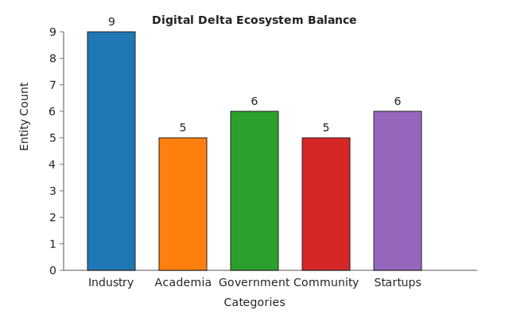

# Digital Delta Map — MVP v1.0

A static snapshot of Memphis' emerging "Digital Delta" ecosystem, blending AI infrastructure momentum with community oversight. Tables are export-ready for Google Sheets or Notion, and coordinates prime the project for future mapping experiments.

**Total Entities Tracked:** 31

## 1. Industry & Corporations
Major investors driving AI infrastructure. Estimated $20B+ regional investment since 2024, with xAI leading expansion and equity debates in Boxtown.

| Entity | Description | Location | Key AI/Energy Tie | Sample Coords (Lat, Lon) |
| --- | --- | --- | --- | --- |
| xAI | Colossus supercomputer buildout; $12B investment, 500+ jobs. | South Memphis | 35 gas turbines (initially unpermitted); Tesla batteries; water recycling plant. | 35.099, -90.025 |
| FedEx | Logistics AI for routing and supply chain; University of Memphis partner. | Midtown Memphis HQ | Digital Delta supporter deploying AI optimization across operations. | 35.149, -90.049 |
| AutoZone | AI inventory prediction supporting 15K+ local jobs. | East Memphis HQ | Retail-tech pilots balancing energy use with automation. | 35.118, -89.970 |
| St. Jude | Biomedical AI diagnostics via PathAI with $100M+ research investment. | Downtown Memphis | Health equity lens on compute-intensive research. | 35.139, -90.019 |
| Ford BlueOval | AI-managed EV battery manufacturing complex ($5.6B). | West Tennessee | Energy-efficient operations near Memphis powering EV supply chain. | 35.250, -89.800 |
| Preteckt | Predictive fleet maintenance startup with sustainability focus. | Memphis | AI reduces emissions for heavy-duty vehicles. | 35.120, -90.000 |
| Ursa Computing | Quantum-AI security firm with regional research roots. | Memphis | Collaborates with University of Memphis researchers on secure compute. | 35.130, -90.010 |
| Clear Function | Enterprise AI for payments/security plus workforce training programs. | Memphis | Custom ML deployments with local talent pipelines. | 35.140, -90.020 |
| Nvidia / Dell / Supermicro | Hardware suppliers enabling the Colossus build; Dell expanding Memphis footprint. | Memphis operations | Billions in infrastructure with grid strain and siting debates. | 35.100, -90.030 |

## 2. Academia & Research
Workforce pipelines and research hubs. The University of Memphis leads the Digital Delta coalition, with AI enrollments up roughly 40% year over year.

| Entity | Description | Location | Key AI/Energy Tie | Sample Coords (Lat, Lon) |
| --- | --- | --- | --- | --- |
| University of Memphis | FedEx Institute of Technology anchors AI R&D; $1M new AI commitment. | Central Memphis | xAI/TVA partners; ethics curriculum expansion. | 35.119, -89.941 |
| UTHSC | UT Verse platform scaling AI for healthcare delivery. | Downtown Memphis | Copilot-style tools with equity focus. | 35.133, -90.021 |
| Christian Brothers University | AI engineering and startup collaboration hub. | Midtown Memphis | Innovation lab with local founders. | 35.158, -90.031 |
| LeMoyne-Owen College | HBCU advancing AI ethics and advocacy programming. | South Memphis | NAACP-aligned workshops for community access. | 35.096, -90.024 |
| Rhodes College | Data science minor integrated with urban equity research. | Midtown Memphis | Partners with nonprofits on responsible tech. | 35.163, -90.039 |

## 3. Government & Infrastructure
Policy and infrastructure enablers. MLGW and TVA project a 20% demand spike with $80M in wastewater upgrades tied to the xAI buildout.

| Entity | Description | Location | Key AI/Energy Tie | Sample Coords (Lat, Lon) |
| --- | --- | --- | --- | --- |
| City of Memphis | Permitting and Digital Delta policy coordination. | Downtown | Equity audits alongside zoning reforms. | 35.149, -90.049 |
| Shelby County | Data center zoning and impact funding strategies. | Memphis | Economic development incentives for AI buildouts. | 35.129, -90.049 |
| MLGW | Utility managing 20% demand spike with AI grid tools. | Midtown | Powering Colossus while upgrading infrastructure. | 35.135, -90.040 |
| TVA | Regional power provider coordinating xAI substation. | Knoxville (Memphis ops) | Balancing gas assets with renewables push. | 35.150, -90.050 |
| Greater Memphis Chamber | Digital Delta branding and supplier matchmaking. | Downtown | xAI advocacy; 2025 Chamber of the Year honors. | 35.138, -90.050 |
| Entergy Arkansas | Utility supporting Google data center expansion across the river. | West Memphis | 600MW solar build aligned with AI load. | 35.147, -90.185 |

## 4. Community & Advocacy
Community voices for environmental justice and responsible AI. South Memphis groups lead opposition to unchecked industrial expansion amid Tennessee's highest asthma rates.

| Entity | Description | Location | Key AI/Energy Tie | Sample Coords (Lat, Lon) |
| --- | --- | --- | --- | --- |
| Memphis Community Against Pollution | Environmental justice coalition tracking industrial pollution. | Southwest Memphis | xAI turbine lawsuits with air monitoring demands. | 35.080, -90.050 |
| NAACP Memphis | Civil rights organization advancing responsible tech guidelines. | Downtown | Hosting 2025 data center equity summit. | 35.130, -90.030 |
| Memphis Technology Foundation | Community tech group offering inclusive training. | Citywide | Ethical AI upskilling and job access workshops. | 35.140, -90.040 |
| Southern Environmental Law Center | Regional legal advocacy challenging fossil-tied data centers. | Memphis | Litigation focused on xAI emissions. | 35.120, -90.020 |
| Moms Clean Air Force | Grassroots group mobilizing against pollution in Boxtown. | Boxtown / South Memphis | Publishes health impact reports on xAI buildout. | 35.095, -90.030 |

## 5. Startups & Creators
Indie innovators building inclusive technology. More than 38 startups engage with the xAI supplier portal, with the sample below highlighting local impact plays.

| Entity | Description | Location | Key AI/Energy Tie | Sample Coords (Lat, Lon) |
| --- | --- | --- | --- | --- |
| Diatech Diabetes | Digital therapeutics startup delivering AI-driven diabetes management. | Memphis | Health equity tools for community clinics. | 35.110, -90.010 |
| WHAI Robotics | Robotics company focused on accessibility solutions. | Memphis | University of Memphis collaboration on inclusive automation. | 35.120, -90.000 |
| MiCare Path | Patient navigation platform using AI and nonprofit partnerships. | Memphis | Supports care coordination for local hospitals. | 35.130, -90.020 |
| Bite Ninja | AI-powered hospitality training solution. | Memphis | Incorporates open-source tooling for restaurants. | 35.140, -90.030 |
| KALiiN | Creative tech platform offering AI tools for filmmakers. | Memphis | Promotes ethical content production. | 35.150, -90.040 |
| Otto JS | Developer tooling startup emerging from local accelerator. | Memphis | Open-source-focused AI development kits. | 35.160, -90.050 |

## Quick Visualization: Ecosystem Balance

A simple bar chart to showcase balanced coverage across the ecosystem. Export the tables to Sheets for deeper visualizations or geospatial plotting.

## MVP Launch Plan
1. **Share It:** Publish on Substack with the note First look at the Digital Delta Map—your feedback shapes v2!
2. **Gather Input:** Link to a Google Sheet and Form to crowdsource additions (e.g., new startups).
3. **Tech Upgrades:** Scope a v1.1 Leaflet.js map using the coordinates above and highlight recent wins like Google’s solar expansion in West Memphis.
4. **Ethics Check:** Keep impact flags current to maintain a balanced, transparent lens.
